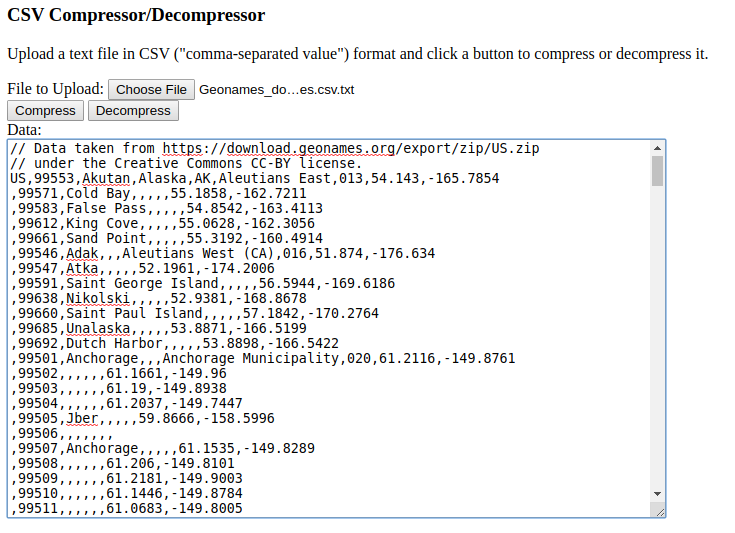

CSV Compressor
==============

The code in this repository implements a CSV compressor in JavaScript.

When run, the user is prompted to specify a text file in .csv ("comma-separated value") format, and can then choose to compress or decompress it.  The method of compression is to remove redundant occurrences of data fields that repeat across multiple rows.

To see it in action, open the file Source/CsvCompressor.html in a web browser that runs JavaScript.

